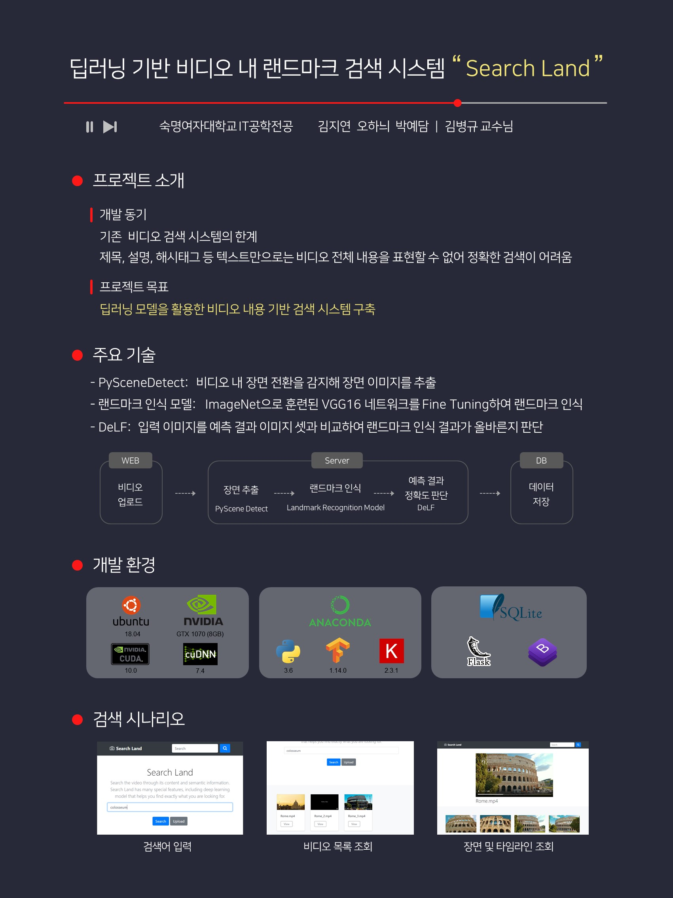

# Development of Landmark Retrieval System for Video Based on Deep Learning

## Poster
  

## Get started
1. Download the data files 'train.csv' (landmark data-set including 44 classes)
2. Set up environment. (refer to 'environment_landmark007.yml')
3. Move on to the codes.


## Codes
### Landmark Recognition Model
The script '**download**' consists of the code to
1. Download resized images
2. Move the images into folders labelled by class name
3. Some visualizations

The script '**train**' consists of the code to Transfer Learning using Keras.

### Web
The script '**app**' consists of the code to **Upload** and **Search** videos.

The script '**predictNew**' consists of the code to predict on test images(video scenes).

The script '**delfNew**' consists of the code used for image retrieval done by matching local features.

The script '**dbNew**' consists of the code to
1. Store data in the database.
2. Copy scene images to ../web/static.
3. Delete some files to reset folder.


## Folder Structure
The folder '**data**' consists of
1. Images to train, validate, and test the model
2. CSV files of the landmark dataset

The folder '**script**' consists of the scripts.

The folder '**web**' consists of
1. Scripts to run web application.
2. Database
3. Videos and images

```
Project
│-- README.md
│-- environment_landmark007.yml
|
|-- data
│   │-- train.csv
│   │-- category.csv
|   |
│   │-- train_images_model
|   |   |-- 1
|   |   |   `-- (images to train the model)
|   |   |-- 2
|   |   |-- ...
|   |   `-- 44
|   |
│   │-- validation_images_model
|   |   |-- 1
|   |   |   `-- (images to validate the model)
|   |   |-- 2
|   |   |-- ...
|   |   `-- 44
|   |
│   `-- test_images_from_train
|       `-- (images to test the model)
|
|-- script
│   │-- download.py
│   │-- train.py
│   │-- predictNew.py
│   │-- delfNew.py
│   `-- dbNew.py
|
|-- web
│   │-- app.py
│   │-- bottleneck_fc_model.h5
│   │-- landmark.db
|   |
│   │-- static
|   |   |-- album.css
|   |   `-- (videos and images)
|   |   
│   │-- templates
|   |   |-- index.html
|   |   |-- upload_video.html
|   |   `-- view.html
```
